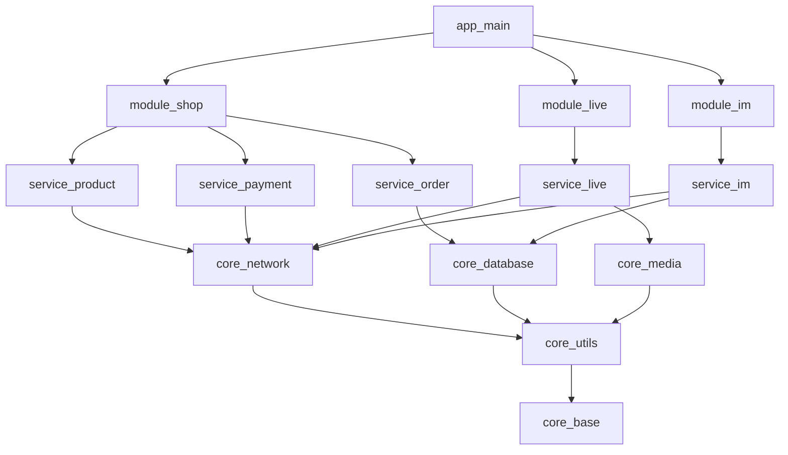

# Package 依赖关系设计

> **文档版本**: v1.0.0
> **创建日期**: 2026-02-24
> **最后更新**: 2026-02-24
> **相关文档**: [01-架构分层职责.md](./01-架构分层职责.md)

---

## 📋 目录

- [1. 依赖关系总览](#1-依赖关系总览)
- [2. 依赖规则](#2-依赖规则)
- [3. 基础设施层依赖](#3-基础设施层依赖)
- [4. 核心能力层依赖](#4-核心能力层依赖)
- [5. 业务服务层依赖](#5-业务服务层依赖)
- [6. 业务模块层依赖](#6-业务模块层依赖)
- [7. 应用层依赖](#7-应用层依赖)
- [8. 依赖管理最佳实践](#8-依赖管理最佳实践)

---

## 1. 依赖关系总览

### 1.1 完整依赖图

```
app_main (应用层)
    ↓ depends on
┌─────────────────────────────────────────────┐
│ module_shop | module_live | module_im       │
│ module_video | module_blog | module_common  │
└─────────────────────────────────────────────┘
    ↓ depends on
┌─────────────────────────────────────────────┐
│ service_user | service_auth | service_order │
│ service_payment | service_content | ...     │
└─────────────────────────────────────────────┘
    ↓ depends on
┌─────────────────────────────────────────────┐
│ core_network | core_database | core_cache   │
│ core_state | core_router | core_ui | ...   │
└─────────────────────────────────────────────┘
    ↓ depends on
┌─────────────────────────────────────────────┐
│ core_base | core_utils | core_exceptions   │
│ core_logging | core_constants | ...        │
└─────────────────────────────────────────────┘
    ↓ no dependencies
```

### 1.2 依赖矩阵

```
层级         │ 依赖层数 │ 依赖包数 │ 被依赖次数
─────────────┼──────────┼──────────┼────────────
应用层       │    5     │   6-10   │     0
业务模块层   │    4     │   5-8    │    4+
业务服务层   │    3     │   3-5    │    10+
核心能力层   │    2     │   2-4    │    20+
基础设施层   │    1     │   0-2    │    35+
平台适配层   │    0     │    0     │    10+
```

### 1.3 Package 总数统计

| 层级 | Package 数量 | 说明 |
|------|-------------|------|
| **应用层** | 4 | app_main, app_shop, app_live, app_video |
| **业务模块层** | 6 | module_*, 按业务线划分 |
| **业务服务层** | 10 | service_*, 按服务能力划分 |
| **核心能力层** | 15 | core_*, 按技术能力划分 |
| **基础设施层** | 10 | core_*, 基础工具 |
| **平台适配层** | 3 | platform_*, 平台插件 |
| **总计** | **48** | |

---

## 2. 依赖规则

### 2.1 基本规则

```
✅ 允许：
   - 上层依赖下层
   - 同层内工具包被业务包依赖
   - 跨层接口依赖（仅限接口定义）

❌ 禁止：
   - 下层依赖上层
   - 循环依赖
   - 跨层实现依赖
```

### 2.2 依赖声明方式

```yaml
# 方式1: 本地路径依赖（开发阶段）
dependencies:
  core_utils:
    path: ../core_utils

# 方式2: Git 依赖（团队协作）
dependencies:
  core_utils:
    git:
      url: https://github.com/yourorg/core_utils.git
      ref: v1.0.0

# 方式3: 已发布版本（生产环境）
dependencies:
  core_utils: ^1.0.0
```

### 2.3 版本管理策略

```
开发阶段: 使用本地路径依赖
   ↓
测试阶段: 使用 Git 依赖 + 标签版本
   ↓
生产阶段: 使用已发布版本
```

---

## 3. 基础设施层依赖

### 3.1 零依赖包

以下包**零依赖**，可独立使用：

```yaml
# core_base/pubspec.yaml
name: core_base
description: 基础类型定义
version: 1.0.0
dependencies: null  # 零依赖

# core_constants/pubspec.yaml
name: core_constants
description: 常量定义
version: 1.0.0
dependencies: null  # 零依赖

# core_exceptions/pubspec.yaml
name: core_exceptions
description: 异常定义
version: 1.0.0
dependencies: null  # 零依赖
```

### 3.2 轻量依赖包

```yaml
# core_utils/pubspec.yaml
name: core_utils
description: 工具函数和扩展方法
version: 1.0.0
dependencies:
  flutter:
    sdk: flutter
  core_base:
    path: ../core_base
  core_constants:
    path: ../core_constants

# core_logging/pubspec.yaml
name: core_logging
description: 日志系统
version: 1.0.0
dependencies:
  flutter:
    sdk: flutter
  core_base:
    path: ../core_base
```

---

## 4. 核心能力层依赖

### 4.1 网络层

```yaml
# core_network/pubspec.yaml
name: core_network
description: 网络请求封装
version: 1.0.0
dependencies:
  flutter:
    sdk: flutter

  # 基础设施层
  core_base:
    path: ../core_base
  core_utils:
    path: ../core_utils
  core_exceptions:
    path: ../core_exceptions
  core_logging:
    path: ../core_logging

  # 第三方库
  dio: ^5.4.0
  connectivity_plus: ^5.0.0
  cookie_jar: ^4.0.0
```

### 4.2 数据库层

```yaml
# core_database/pubspec.yaml
name: core_database
description: 数据库封装
version: 1.0.0
dependencies:
  flutter:
    sdk: flutter

  # 基础设施层
  core_base:
    path: ../core_base
  core_utils:
    path: ../core_utils
  core_logging:
    path: ../core_logging

  # 第三方库
  sqflite: ^2.3.0
  path_provider: ^2.1.0
  path: ^1.8.0
```

### 4.3 缓存层

```yaml
# core_cache/pubspec.yaml
name: core_cache
description: 多级缓存
version: 1.0.0
dependencies:
  flutter:
    sdk: flutter

  # 基础设施层
  core_base:
    path: ../core_base
  core_utils:
    path: ../core_utils
  core_logging:
    path: ../core_logging

  # 核心能力层
  core_database:
    path: ../core_database

  # 第三方库
  shared_preferences: ^2.2.0
  flutter_cache_manager: ^3.3.0
```

### 4.4 状态管理层

```yaml
# core_state/pubspec.yaml
name: core_state
description: 状态管理
version: 1.0.0
dependencies:
  flutter:
    sdk: flutter

  # 基础设施层
  core_base:
    path: ../core_base
  core_utils:
    path: ../core_utils
  core_logging:
    path: ../core_logging

  # 第三方库
  flutter_riverpod: ^2.4.0
  riverpod_annotation: ^2.3.0
```

### 4.5 UI 组件层

```yaml
# core_ui/pubspec.yaml
name: core_ui
description: UI 组件库
version: 1.0.0
dependencies:
  flutter:
    sdk: flutter
  flutter_localizations:
    sdk: flutter

  # 基础设施层
  core_base:
    path: ../core_base
  core_utils:
    path: ../core_utils
  core_constants:
    path: ../core_constants

  # 核心能力层
  core_router:
    path: ../core_router
  core_state:
    path: ../core_state

  # 第三方库
  flutter_svg: ^2.0.0
  cached_network_image: ^3.3.0
  shimmer: ^3.0.0
  lottie: ^2.7.0
```

---

## 5. 业务服务层依赖

### 5.1 用户服务

```yaml
# service_user/pubspec.yaml
name: service_user
description: 用户服务
version: 1.0.0
dependencies:
  flutter:
    sdk: flutter

  # 核心能力层
  core_network:
    path: ../../core/core_network
  core_database:
    path: ../../core/core_database
  core_cache:
    path: ../../core/core_cache
  core_state:
    path: ../../core/core_state
  core_utils:
    path: ../../core/core_utils

  # 第三方库
  json_annotation: ^4.8.0

dev_dependencies:
  build_runner: ^2.4.0
  json_serializable: ^6.7.0
```

### 5.2 认证服务

```yaml
# service_auth/pubspec.yaml
name: service_auth
description: 认证服务
version: 1.0.0
dependencies:
  flutter:
    sdk: flutter

  # 核心能力层
  core_network:
    path: ../../core/core_network
  core_database:
    path: ../../core/core_database
  core_cache:
    path: ../../core/core_cache
  core_state:
    path: ../../core/core_state
  core_utils:
    path: ../../core/core_utils

  # 业务服务层
  service_user:
    path: ../service_user

  # 第三方库
  json_annotation: ^4.8.0
  crypto: ^3.0.0
```

### 5.3 订单服务

```yaml
# service_order/pubspec.yaml
name: service_order
description: 订单服务
version: 1.0.0
dependencies:
  flutter:
    sdk: flutter

  # 核心能力层
  core_network:
    path: ../../core/core_network
  core_database:
    path: ../../core/core_database
  core_cache:
    path: ../../core/core_cache
  core_state:
    path: ../../core/core_state

  # 业务服务层
  service_user:
    path: ../service_user
  service_product:
    path: ../service_product
```

---

## 6. 业务模块层依赖

### 6.1 电商模块

```yaml
# module_shop/pubspec.yaml
name: module_shop
description: 电商模块
version: 1.0.0
dependencies:
  flutter:
    sdk: flutter
  flutter_localizations:
    sdk: flutter

  # 核心能力层
  core_ui:
    path: ../../core/core_ui
  core_router:
    path: ../../core/core_router
  core_state:
    path: ../../core/core_state
  core_media:
    path: ../../core/core_media

  # 业务服务层
  service_user:
    path: ../../services/service_user
  service_product:
    path: ../../services/service_product
  service_order:
    path: ../../services/service_order
  service_payment:
    path: ../../services/service_payment
  service_cart:
    path: ../../services/service_cart

  # 公共模块
  module_common:
    path: ../module_common
```

### 6.2 直播模块

```yaml
# module_live/pubspec.yaml
name: module_live
description: 直播模块
version: 1.0.0
dependencies:
  flutter:
    sdk: flutter

  # 核心能力层
  core_ui:
    path: ../../core/core_ui
  core_router:
    path: ../../core/core_router
  core_state:
    path: ../../core/core_state
  core_media:
    path: ../../core/core_media
  core_permission:
    path: ../../core/core_permission

  # 业务服务层
  service_user:
    path: ../../services/service_user
  service_live:
    path: ../../services/service_live

  # 直播 SDK
  agora_rtc_engine: ^6.0.0
  agora_uikit: ^1.0.0

  # 公共模块
  module_common:
    path: ../module_common
```

### 6.3 IM 模块

```yaml
# module_im/pubspec.yaml
name: module_im
description: 即时通讯模块
version: 1.0.0
dependencies:
  flutter:
    sdk: flutter

  # 核心能力层
  core_ui:
    path: ../../core/core_ui
  core_router:
    path: ../../core/core_router
  core_state:
    path: ../../core/core_state
  core_media:
    path: ../../core/core_media

  # 业务服务层
  service_user:
    path: ../../services/service_user
  service_im:
    path: ../../services/service_im

  # 腾讯 IM SDK
  tencent_cloud_chat_sdk: ^8.0.0
  tencent_calls_uikit: ^2.0.0

  # 公共模块
  module_common:
    path: ../module_common
```

---

## 7. 应用层依赖

### 7.1 综合主应用

```yaml
# app_main/pubspec.yaml
name: app_main
description: 综合主应用
version: 1.0.0
publish_to: 'none'

dependencies:
  flutter:
    sdk: flutter
  flutter_localizations:
    sdk: flutter

  # 业务模块层 - 按需引入
  module_common:
    path: ../../modules/module_common
  module_shop:
    path: ../../modules/module_shop
  module_live:
    path: ../../modules/module_live
  module_im:
    path: ../../modules/module_im
  module_video:
    path: ../../modules/module_video
  module_blog:
    path: ../../modules/module_blog

  # 核心能力层 - 全局配置
  core_ui:
    path: ../../core/core_ui
  core_router:
    path: ../../core/core_router
  core_state:
    path: ../../core/core_state
  core_analytics:
    path: ../../core/core_analytics
  core_push:
    path: ../../core/core_push

dev_dependencies:
  flutter_test:
    sdk: flutter
  flutter_lints: ^3.0.0

flutter:
  uses-material-design: true
  assets:
    - assets/images/
    - assets/icons/
    - assets/animations/
```

### 7.2 电商独立应用

```yaml
# app_shop/pubspec.yaml
name: app_shop
description: 电商独立应用
version: 1.0.0
publish_to: 'none'

dependencies:
  flutter:
    sdk: flutter

  # 只引入电商相关模块
  module_common:
    path: ../../modules/module_common
  module_shop:
    path: ../../modules/module_shop

  # 核心能力
  core_ui:
    path: ../../core/core_ui
  core_router:
    path: ../../core/core_router
  core_analytics:
    path: ../../core/core_analytics
```

---

## 8. 依赖管理最佳实践

### 8.1 依赖检查脚本

```yaml
# melos.yaml
scripts:
  # 检查循环依赖
  check:deps:
    run: melos exec -c 1 -- dart run dependency_validator
    description: 检查依赖关系

  # 检查依赖版本
  check:versions:
    run: melos exec -c 1 -- dart pub outdated
    description: 检查依赖版本

  # 升级依赖
  upgrade:deps:
    run: melos exec -c 1 -- dart pub upgrade
    description: 升级所有依赖
```

### 8.2 依赖优化建议

```
✅ 推荐做法：
   - 使用接口依赖，而非实现依赖
   - 基础层零依赖或轻量依赖
   - 上层按需引入依赖
   - 定期检查和清理无用依赖

❌ 避免做法：
   - 循环依赖
   - 过度依赖（引入不需要的包）
   - 跨层依赖
   - 直接依赖具体实现
```

### 8.3 依赖版本策略

```yaml
# 主版本锁定（重大更新）
dependencies:
  core_network: ^5.0.0  # 5.x.x，但 < 6.0.0

# 精确版本（生产环境）
dependencies:
  core_network: 5.4.0  # 精确版本

# Git 依赖（开发阶段）
dependencies:
  core_network:
    git:
      url: https://github.com/yourorg/core_network.git
      ref: main  # 或 tag/commit hash
```

---

## 9. 附录

### 9.1 依赖关系图（Mermaid）



### 9.2 相关文档

- [00-架构概览.md](./00-架构概览.md)
- [01-架构分层职责.md](./01-架构分层职责.md)
- [03-核心Package设计.md](./03-核心Package设计.md)

---

**更新记录**

| 版本 | 日期 | 变更内容 | 负责人 |
|------|------|----------|--------|
| v1.0.0 | 2026-02-24 | 初始版本 | 架构团队 |
